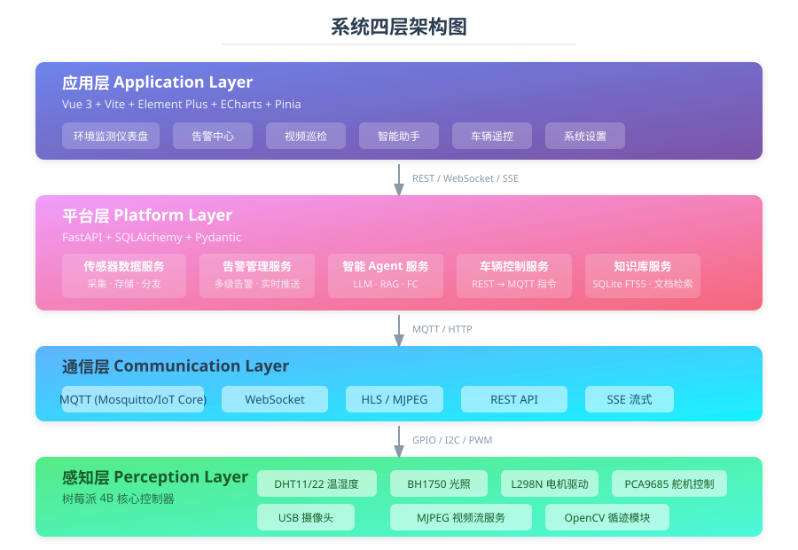
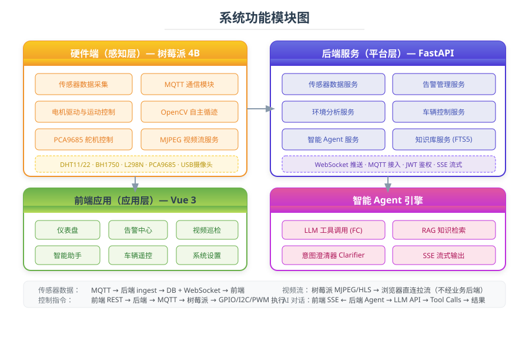
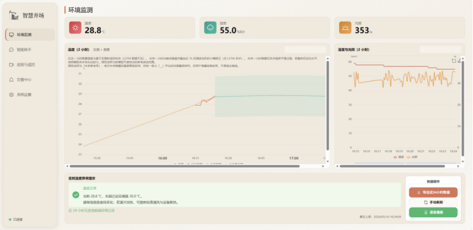
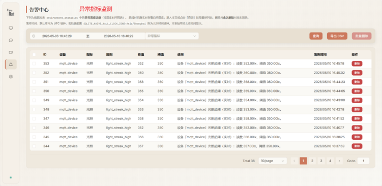
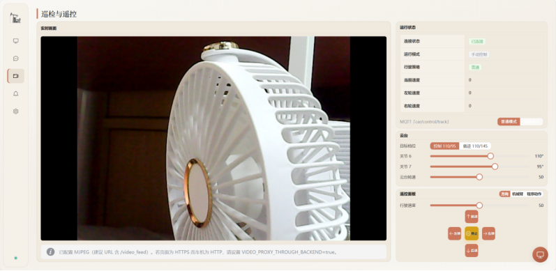
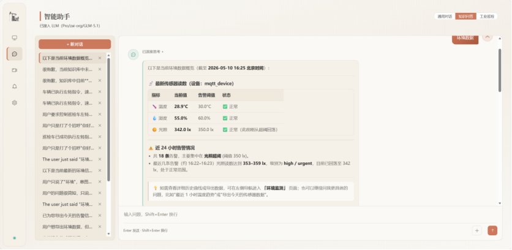
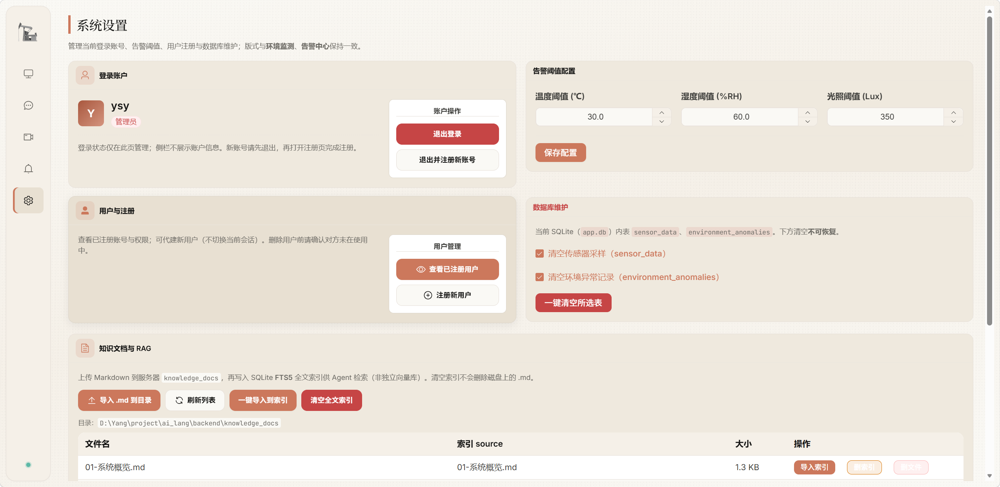
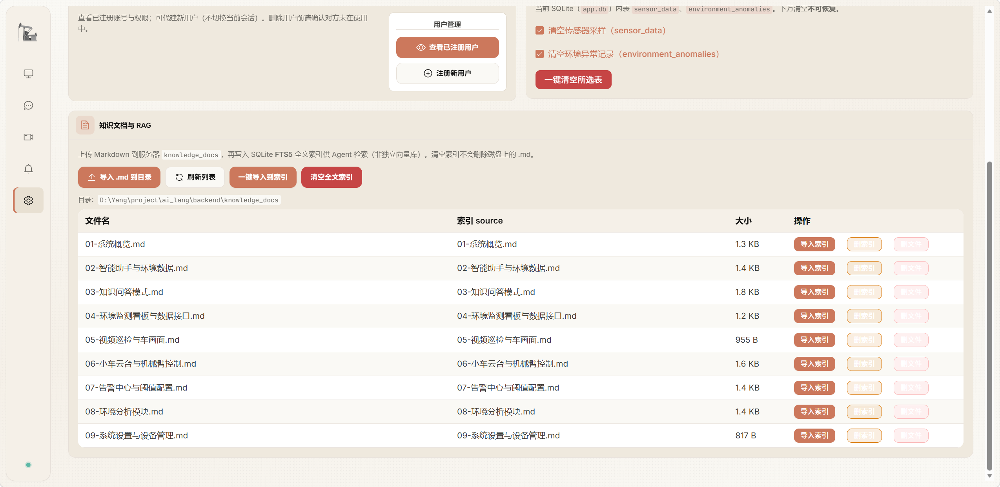
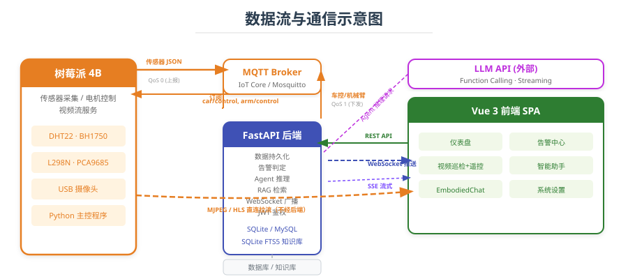

# 井场环境监测与智能巡检系统

基于物联网四层架构的井场环境监测与智能巡检车远程控制平台，集成传感器数据采集、MQTT 实时通信、视频巡检、多级告警、大语言模型智能 Agent 与自主循迹能力。

下文中的 **架构图 / 模块图 / 数据流图**（SVG）便于理解整体设计；**界面截图**（PNG）对应各功能模块的实际效果，可在 GitHub 或本地预览中直接查看。

---

## 系统架构

系统采用**感知层 → 通信层 → 平台层 → 应用层**四层物联网架构，各层之间通过标准化接口解耦交互。



- **感知层**：以树莓派 4B 为核心控制器，集成 DHT11/22 温湿度传感器、BH1750 光照传感器、L298N 电机驱动、PCA9685 舵机控制与 USB 摄像头，负责环境数据采集、运动控制和视频流推送
- **通信层**：MQTT（传感器上报与控制指令下发）、WebSocket（实时数据推送）、SSE（Agent 流式输出）、HTTP REST API 和 HLS/MJPEG 视频流多协议协同
- **平台层**：FastAPI 构建的 RESTful 后端，集成 SQLAlchemy ORM 持久化、SQLite FTS5 全文检索知识库、多级告警引擎、环境分析服务（含 LSTM 温度预测）和基于大语言模型的智能 Agent
- **应用层**：Vue 3 + Vite 单页面应用，JWT 鉴权，提供仪表盘、告警中心、视频巡检与遥控、智能助手、具身对话面板和系统设置等模块

---

## 功能模块（总览）

下图从**硬件端、后端、前端、智能 Agent** 四个维度概括功能划分及协作关系。



### 环境监测仪表盘

温度、湿度、光照三类传感器数据的实时卡片展示与 ECharts 历史趋势图表，支持时间范围选择、数据缩放、统计摘要（最大/最小/平均/中位数）和 CSV 导出。



### 告警中心

基于阈值的多级告警（低 / 中 / 高 / 严重），采用边沿触发策略避免重复告警；通过 WebSocket 实时推送至前端，附带桌面通知与声音提醒；支持按类型、级别和时间范围筛选历史告警记录。



### 视频巡检与遥控

- **视频监控**：支持 HLS 和 MJPEG 两种视频流格式，由树莓派端 HTTP 服务提供，浏览器直连拉流，视频码流不经业务后端
- **手动遥控**：Web 界面远程控制巡检车前进/后退/左转/右转，支持速度调节（0-100）与持续时间设定，命令超时自动停车
- **自主循迹**：基于 OpenCV 的视觉循迹——灰度转换 → 高斯模糊 → 二值化 → 形态学开运算 → 轮廓检测 → 比例控制差速驱动，循迹画面带 HUD 叠加
- **机械臂与云台**：6 自由度机械臂关节角度控制（0°-180°）+ 2 轴云台（pan/tilt），支持普通/循迹模式自动摆位



### 智能助手

集成大语言模型的智能 Agent，支持多种对话模式：

- **通用对话**：自然语言查询传感器数据、告警记录和环境分析结果，Agent 自动调用 Function Calling 工具获取数据
- **知识问答（RAG）**：基于 SQLite FTS5 全文检索，将操作手册、配置说明等文档分块入库，提问时检索相关片段增强回答
- **工业巡检**：安全审计与反思链路，适合高风险操作建议场景
- **具身控制**（具身对话面板）：通过自然语言指令控制巡检车和机械臂（如「前进 3 秒后左转」「抬起机械臂」），Agent 将语义转换为 MQTT 控制指令



### 系统设置与知识库

设备管理、告警阈值配置；知识库支持管理员上传操作手册与运维文档入库（与 RAG 检索联动）。





---

## 数据流

下图展示树莓派、MQTT Broker、FastAPI 后端、Web 前端之间的典型数据与控制路径（含 WebSocket、SSE、直连视频等）。



| 数据流向 | 协议 | 说明 |
|---------|------|------|
| 传感器数据上报 | MQTT (QoS 0) | 树莓派 → IoT Core → 后端 ingest → DB + WebSocket 广播 → 前端 |
| 控制指令下发 | MQTT (QoS 1) | 前端 REST → 后端 → MQTT → 树莓派 → GPIO/I2C/PWM 执行 |
| 实时数据推送 | WebSocket | 后端 → 前端（传感器更新、告警、车辆状态） |
| Agent 对话 | SSE | 前端 ← 后端 Agent → LLM API（逐字流式 + Tool Calls） |
| 视频流 | HTTP (HLS/MJPEG) | 树莓派 → 浏览器直连拉流，不经业务后端 |

---

## 技术栈

| 层级 | 技术选型 |
|------|---------|
| 硬件控制 | Python 3.9+, RPi.GPIO, smbus2, OpenCV, pigpio |
| 通信协议 | MQTT 3.1.1 (paho-mqtt), WebSocket, SSE |
| 后端框架 | FastAPI + Uvicorn (ASGI) |
| ORM | SQLAlchemy 2.0 (异步) |
| 数据校验 | Pydantic v2 |
| 数据库 | SQLite (WAL 模式)，可迁移至 MySQL 8.0 |
| 缓存 | Redis 7.0 (生产环境) |
| 知识库 | SQLite FTS5 全文检索 |
| AI/ML | OpenAI-compatible API, LangGraph, PyTorch (LSTM) |
| 前端框架 | Vue 3 (Composition API) + Vite |
| UI 组件库 | Element Plus |
| 图表 | ECharts 5 |
| 状态管理 | Pinia |
| 视频播放 | hls.js (HLS) / MJPEG (img 标签) |
| 构建工具 | Vite |

---

## 项目结构

```
ai_lang/
├── backend/                # FastAPI 后端服务
│   ├── app/
│   │   ├── api/v1/         # REST API 路由 (auth, sensors, alarms, agent, vehicle, analysis, video)
│   │   ├── core/           # 配置管理、安全、MQTT 客户端
│   │   ├── models/         # SQLAlchemy ORM 模型
│   │   ├── schemas/        # Pydantic 请求/响应模型
│   │   ├── services/       # 业务逻辑层 (sensor, alarm, agent, analysis, vehicle, knowledge)
│   │   ├── repositories/   # 数据访问层
│   │   ├── websocket/      # WebSocket 连接管理
│   │   └── main.py         # 应用入口
│   ├── tests/
│   └── requirements.txt
├── web-frontend/           # Vue 3 前端应用
│   ├── src/
│   │   ├── api/            # Axios 接口封装
│   │   ├── views/          # 页面组件 (Dashboard, AlarmCenter, InspectionVehicle, AgentAssistant, Settings, Login, Register)
│   │   ├── store/          # Pinia 状态管理
│   │   ├── router/         # Vue Router 路由配置
│   │   └── utils/          # 工具函数
│   ├── package.json
│   └── vite.config.js
├── doc/                    # 设计文档与需求文档
│   └── img/                # 架构图、数据流图与界面截图
└── ml_training/            # LSTM 温度预测模型训练
```

---

## 快速开始

### 环境依赖

- Python 3.12+
- Node.js 18+
- MQTT Broker（Mosquitto 或百度智能云 IoT Core）

### 后端

```bash
cd backend
python -m venv .venv

# Windows
.venv\Scripts\activate
# Linux / macOS
source .venv/bin/activate

pip install -r requirements.txt
uvicorn app.main:app --host 0.0.0.0 --port 8000 --reload
```

启动后访问 http://localhost:8000/docs 查看 Swagger API 文档。

### 前端

```bash
cd web-frontend
npm install
npm run dev
```

前端开发服务器默认 http://localhost:5173，API 请求代理至后端 8000 端口。

### 配置要点

- **MQTT**：在 `backend/.env` 中配置 `MQTT_ENABLED=true` 及 Broker 地址、凭证和主题；硬件端通过 `config.yaml` 配置
- **视频流**：树莓派端 MJPEG 服务默认监听 8080 端口，前端通过 `/api/video/stream-config` 获取播放地址
- **LLM Agent**：在 `backend/.env` 中配置 `LLM_API_KEY`、`LLM_BASE_URL`、`LLM_MODEL` 等参数
- **数据库**：默认使用 SQLite，生产环境建议迁移至 MySQL 8.0 + Redis 7.0

---

## 硬件端（树莓派）

井场环境采集、MQTT 上报、电机与舵机控制、OpenCV 循迹及 MJPEG 视频等**硬件侧代码**独立于本仓库，见毕业设计仓库：

**[Goushi666/raspberry-pi — 井场环境分析与监测硬件端（树莓派）](https://github.com/Goushi666/raspberry-pi.git)**

仓库内包含运行方式、`config/` 配置说明及与上层软件的通讯对接文档，可与本项目的 `backend` + `web-frontend` 联调使用。
