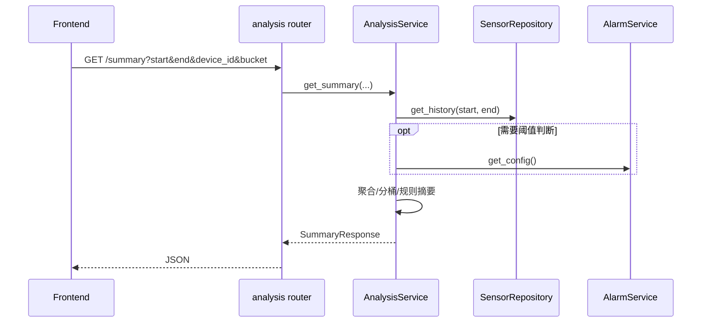

# 后端设计 · 环境分析模块

## 1. 定位

- **AnalysisService**：依赖 `SensorRepository`（及可选 `AlarmService.get_config`）完成时间窗聚合与规则摘要。
- **与 Agent 解耦**：`AgentService` 通过 HTTP 内部调用或同进程函数调用 `AnalysisService.get_summary(...)`，不将原始全量历史塞入 LLM。

## 2. 目录与文件（建议）

```
app/
├── api/v1/
│   └── analysis.py          # 路由前缀 /api/analysis
├── services/
│   └── analysis_service.py
├── schemas/
│   └── analysis.py          # SummaryResponse, BucketSeries 等
```

## 3. 核心流程



## 4. 数据结构与算法（MVP）

- **聚合**：单次遍历历史点计算 min/max/sum/count，derive mean。
- **分桶**：按 `bucket` 将 `timestamp` 映射到桶键（如 UTC 小时），每桶内同样聚合。
- **摘要规则（示例）**：
  - `insufficient_data`：点数 &lt; 配置下限；
  - `temp_spike`：存在连续 k 个点 &gt; 高温阈值；
  - `stable`：各指标均在配置舒适区内。
- 规则表可后续外置为 YAML/DB，首版硬编码 + `AlarmConfig` 阈值即可。

## 5. API 形状（示例）

`GET /api/analysis/environment/summary`

查询参数：

- `start_time`, `end_time`（ISO8601，必填）
- `device_id`（可选）
- `bucket`（可选：`none` | `1h`）

响应体（示例字段）：

```json
{
  "device_id": "dev_001",
  "window": { "start": "...", "end": "..." },
  "aggregate": {
    "temperature": { "count": 120, "min": 22.1, "max": 28.4, "avg": 24.5 },
    "humidity": { "count": 120, "min": 45, "max": 72, "avg": 58.2 },
    "light": { "count": 120, "min": 100, "max": 800, "avg": 400 }
  },
  "buckets": [],
  "summary_code": "stable",
  "summary_hints": ["温度整体在设定舒适区间内"]
}
```

`POST /api/analysis/environment/run`（可选）与 GET 相同参数，用于强制刷新缓存（若未来加缓存）。

## 6. WebSocket（可选）

消息类型建议：`analysis_summary`

```json
{
  "type": "analysis_summary",
  "payload": {
    "generated_at": 1710000000000,
    "summary_code": "temp_spike",
    "window": { "start": "...", "end": "..." }
  },
  "timestamp": 1710000000000
}
```

载荷宜 **短小**，详情由前端再拉 REST。

## 7. 性能

- 对 `get_history` 结果在内存中计算；若点数超过 `ANALYSIS_MAX_POINTS`，先 **均匀降采样** 再聚合，并在响应中加 `downsampled: true`。

## 8. 配置项（环境变量示例）

- `ANALYSIS_MAX_POINTS`：默认如 5000
- `ANALYSIS_ENABLED`：默认 true
