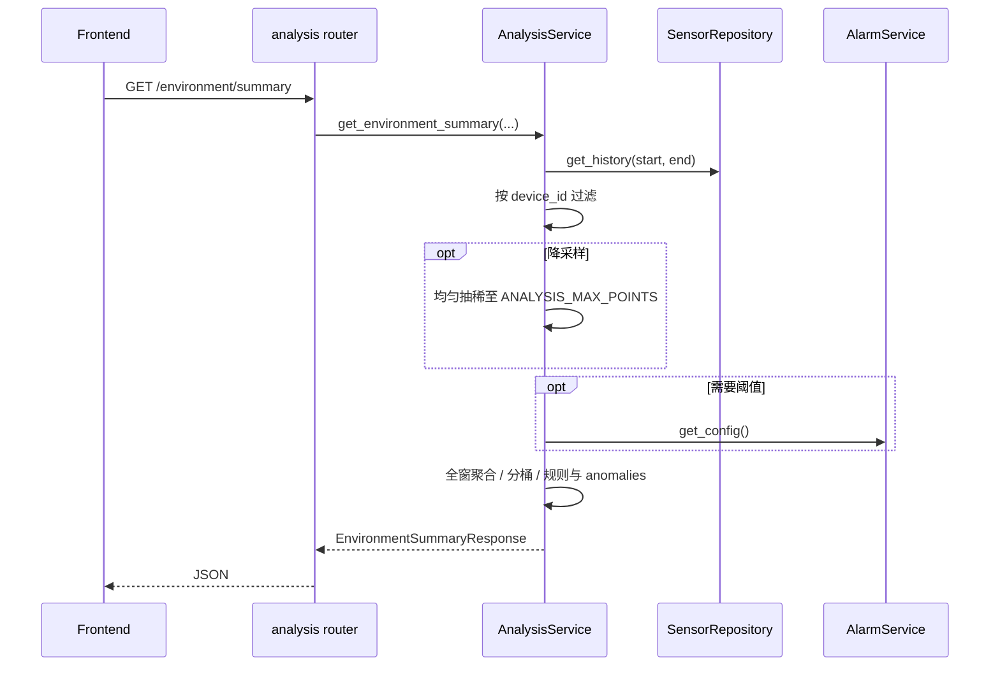
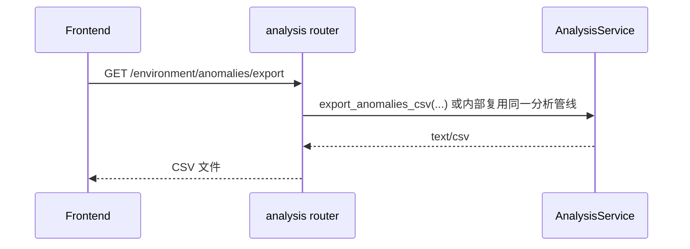

# 后端设计 · 环境分析模块

## 0. 文档说明

- **需求与验收口径**见 [`../../prd/backend/08-环境分析.md`](../../prd/backend/08-环境分析.md)。
- 本文档描述 **服务职责、依赖、数据流、算法要点、API/Schema 约定与配置**，供实现与 Code Review 对照。

---

## 1. 定位与边界

### 1.1 职责

- **AnalysisService**：在指定时间窗内，基于 **与 `GET /api/sensors/history` 同源** 的采样数据，完成 **统计聚合、可选分桶、规则型异常检测、结构化摘要与异常列表**；可选读 **告警阈值配置**（`AlarmService.get_config`）参与越限判定。
- **不承担**：MQTT 解析与入库、实时告警写入、原始点列全量导出（归属传感器模块）、自然语言长文生成（归属 Agent）。

### 1.2 与 Agent 的关系

- **同进程推荐**：`AgentService` 通过工具分发器调用 `AnalysisService.get_environment_summary(...)`（或等价方法），**禁止**把原始全量时序塞进 LLM。
- **禁止**：在模型侧推算 min/max/avg 或判定异常；工具返回值为 **本模块已序列化的 JSON 子集**。

---

## 2. 依赖与数据前提

### 2.1 必读依赖

| 依赖 | 用途 |
|------|------|
| **SensorRepository**（或封装其的 SensorService） | `get_history(start, end)` 拉取时间窗内点列；过滤 `device_id` 在 Service 内完成 |
| **AlarmService.get_config**（可选） | 读取 `AlarmConfig`（temperature/humidity/light 阈值），用于越限与「持续超阈」规则 |

### 2.2 数据源一致性（关键）

- 分析所用历史必须与 **MQTT/REST 写入的持久化（或统一内存单例）** 一致，见 PRD [`01-传感器与环境数据`](../../prd/backend/01-传感器与环境数据.md) §1.5。
- **实现约束**：`SensorRepository` 在进程内应为 **单例**（如挂 `app.state`），`sensor_service_dep` 与 MQTT 回调、**AnalysisService** 注入 **同一实例**，避免出现「history 有数据、分析为空」。

### 2.3 时间与区间

- 采样与查询时间戳统一为 **UTC**；`start_time` / `end_time` 与 `get_history` 语义一致。
- 时间窗闭区间 **`[start_time, end_time]`**（与现有 `SensorRepository.get_history` 一致），在 OpenAPI 中写死，避免前后端歧义。

---

## 3. 目录与模块

```
app/
├── api/v1/
│   └── analysis.py              # 前缀 /api/analysis
├── services/
│   └── analysis_service.py      # AnalysisService
├── schemas/
│   └── analysis.py              # 请求/响应 Pydantic 模型
```

可选演进：规则外置时增加 `app/analysis/rules.py` 或配置加载层，首版可硬编码 + 环境变量。

---

## 4. 核心流程

### 4.1 摘要（主路径）



### 4.2 触发重算

- `POST /environment/run`：**与 GET 摘要相同入参、相同计算逻辑**，无独立缓存时与 GET 完全等价；用于前端「刷新分析」。

### 4.3 异常导出



导出列与摘要中 `anomalies[]` **语义一致**（见 §6）；无异常时 **200 + 表头、0 行**（与 PRD 约定）。

---

## 5. 算法说明

### 5.1 过滤

1. `get_history` 得到有序点列。
2. 若传入 `device_id`，仅保留 `row.device_id == device_id`。
3. 若未传 `device_id`：**产品默认「全设备混合聚合」**（所有点进入同一统计）；响应 `device_id` 字段填 `"all"`。若未来改为「默认最近活跃设备」，须在 OpenAPI 与 PRD 同步修改。

### 5.2 降采样

- 若点数 `> ANALYSIS_MAX_POINTS`：**均匀抽稀**（保留首、尾点，中间等间隔取点），再参与聚合与规则；响应 `downsampled: true`，`summary_hints` 可加一条说明。

### 5.3 聚合（全窗）

对 **temperature / humidity / light** 各维度单次遍历：

- `count`、`min`、`max`、`sum` → `avg = sum / count`；`count == 0` 时 min/max/avg 为 `null`。

缺测策略（是否包含某字段为 NaN 的点）：**首版可要求三点齐全才计入 count**，并在 OpenAPI 注明。

### 5.4 分桶（`bucket`）

- 未传或 `none`：`buckets = []`。
- `1h`：按 **UTC** 将 `timestamp` 归并到小时桶键（如 `YYYY-MM-DDTHH:00:00Z`），每桶内独立做 §5.3 聚合；无数据桶可省略或显式 `count: 0`（与前端约定一种）。

### 5.5 规则型异常与 `summary_code`

首版 **非 ML**，阈值来自 `AlarmConfig`（或后续独立舒适区配置）。

| 规则意图 | 条件示例 | 产出 |
|----------|----------|------|
| 数据不足 | 过滤后有效点数 `count < ANALYSIS_MIN_POINTS` | `summary_code = insufficient_data`，`anomalies` 可为空 |
| 温度持续偏高 | 连续 **k** 个点的 `temperature > temperature_threshold` | `temp_spike` 或 `mixed`，写入 `anomalies` 片段（起止时间、peak、threshold） |
| 湿度/光照越限 | 连续 k 点或单次超 `humidity_threshold` / `light_threshold` | `humidity_high` / `light_high` 等，片段入 `anomalies` |
| 稳定 | 无上述异常且数据充足 | `stable` |

**优先级（确定性）**：`insufficient_data` **优先于** 其他结论；其余并存时可用 `mixed`，并在 `summary_hints` 中列多条原因。

**连续 k**：默认可由环境变量配置（如 `ANALYSIS_STREAK_POINTS`，默认 3）。

**`anomalies` 片段字段**（与 PRD 对齐）：

- `device_id`、`metric`（`temperature` | `humidity` | `light`）
- `type` 或 `rule_id`（字符串，如 `temp_streak_high`）
- `start_time`、`end_time`（ISO 8601）
- `peak`、`threshold`（可选，float）

---

## 6. Schema 约定（`app/schemas/analysis.py`）

### 6.1 共用模型

- **AggregateMetric**：`count`, `min`, `max`, `avg`（可选 null）
- **TimeWindow**：`start`, `end`（ISO 8601 字符串）
- **BucketSeries**（建议）：`bucket_start`, `aggregate: dict[str, AggregateMetric]`（或与 `aggregate` 同形字段）

### 6.2 异常项

- **AnomalyItem**：与 §5.5 字段一致，便于列表与 CSV 共用列定义。

### 6.3 摘要响应 **EnvironmentSummaryResponse**

| 字段 | 类型 | 说明 |
|------|------|------|
| `device_id` | str | 请求过滤设备或 `"all"` |
| `window` | TimeWindow | 分析窗 |
| `aggregate` | dict[str, AggregateMetric] | 温度/湿度/光照 |
| `buckets` | list | 分桶序列，`bucket=none` 时为 `[]` |
| `anomalies` | list[AnomalyItem] | 无异常 `[]` |
| `summary_code` | str | 主结论码 |
| `summary_hints` | list[str] | 短提示 |
| `downsampled` | bool | 默认 false |
| `framework` | bool | 占位实现时为 true，正式版 false 或移除 |

---

## 7. REST 设计（与实现对齐）

**前缀**：`/api/analysis`

| 方法 | 路径 | 说明 |
|------|------|------|
| GET | `/environment/summary` | Query：`start_time`, `end_time`, `device_id?`, `bucket?` |
| POST | `/environment/run` | 与 GET 相同 Query，body 无必填 |
| GET | `/environment/anomalies/export` | 同上 Query；`text/csv` |

**校验**：

- `start_time > end_time` 或非法时间：**400**
- `bucket` 非法值：**400**
- `ANALYSIS_ENABLED=false`：**503**（与 PRD 一致）

**空窗**：**200**，`aggregate` 各指标 `count=0`，`summary_code` 建议 `insufficient_data`，不编造数值。

---

## 8. WebSocket（演进）

- 消息类型 **`analysis_summary`**，载荷仅含：`generated_at`（ms）、`summary_code`、`window` 摘要；详情由客户端再拉 REST。首版可不实现。

---

## 9. 非功能与运维

- **性能**：常规数据量 P95 目标见 [`07-非功能与演进`](../../prd/backend/07-非功能与演进.md)；超时 **504** 或降级（仅全窗聚合、省略 `buckets`）需在发布说明中写明。
- **日志**：错误打栈；禁止打印完整原始点列。
- **导出**：超大窗口可限制最大 `anomalies` 行数，超限 **400** 或截断 + 响应头提示（与 PRD/OpenAPI 一致）。

---

## 10. 配置项（环境变量）

| 变量 | 说明 | 示例默认 |
|------|------|----------|
| `ANALYSIS_ENABLED` | 关闭时摘要返回 503 | `true` |
| `ANALYSIS_MAX_POINTS` | 超过则降采样 | `5000` |
| `ANALYSIS_MIN_POINTS` | 低于则数据不足结论 | `3` |
| `ANALYSIS_STREAK_POINTS` | 连续越限点数 k | `3` |

`SENSOR_HISTORY_RETENTION_DAYS` 由传感器持久化模块实现；分析层仅依赖 `get_history` 可见数据。

---

## 11. Agent 工具映射（实现参考）

| 工具名（建议） | 调用 |
|----------------|------|
| `get_environment_analysis` | `AnalysisService.get_environment_summary(start_time, end_time, device_id, bucket)` |

返回体为 **EnvironmentSummaryResponse 的 JSON**，可裁剪敏感字段（若有）。

---

## 12. 分期与实现对照

| 阶段 | 设计落点 |
|------|----------|
| MVP | 同源 Repo、全窗聚合、`summary_code`/`summary_hints`、可选 `AlarmConfig`、单设备或 `all` |
| MVP+ | `bucket=1h`、`anomalies`、`downsampled`、导出 CSV、`ANALYSIS_*` 配置 |
| 演进 | 规则 YAML/DB、舒适区独立配置、WebSocket、异步长任务 |

当前代码中 `AnalysisService` 若为占位，以本文档与 PRD 为验收目标逐步替换实现。
