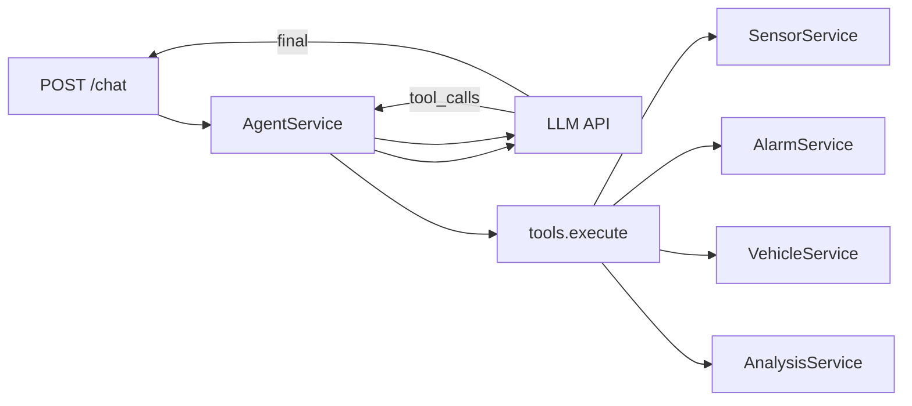

# 后端设计 · Agent 模块

## 1. 定位

- **AgentService**：编排 LLM 请求与 **多轮工具调用**（ReAct / OpenAI tools 风格），工具实现为对现有 Service 的薄封装。
- **独立路由**：`app/api/v1/agent.py`，前缀 `/api/agent`，与业务 CRUD 分离。

## 2. 目录与文件（建议）

```
app/
├── api/v1/
│   └── agent.py
├── services/
│   └── agent_service.py
├── agent/
│   ├── __init__.py
│   ├── tools.py              # 工具定义 + 执行分发
│   ├── prompts.py            # 系统提示词模板
│   └── llm_client.py         # 封装 OpenAI 兼容 SDK / httpx
├── schemas/
│   └── agent.py              # ChatRequest, ChatResponse
```

## 3. 请求/响应（非流式）

`POST /api/agent/chat`

```json
{
  "session_id": "optional-uuid",
  "messages": [
    { "role": "user", "content": "过去一小时温度最高多少？" }
  ]
}
```

```json
{
  "content": "根据查询，过去一小时内温度最高为 28.4℃。",
  "session_id": "uuid",
  "usage": { "prompt_tokens": 0, "completion_tokens": 0 }
}
```

调试环境可增 `debug_tool_trace: [...]`，生产默认关闭。

## 4. 工具注册与执行

`tools.py` 中维护 **名称 → 异步函数** 映射：

| 工具名 | 实现 |
|--------|------|
| `get_sensor_latest` | `SensorService.get_latest` |
| `get_sensor_history` | `SensorService.get_history`（限制 max 条数） |
| `get_alarms_history` | `AlarmService.get_history` |
| `get_vehicle_status` | `VehicleService.get_status` |
| `get_environment_analysis` | `AnalysisService.get_summary` |

工具返回 **JSON 可序列化对象**，由 LLM 下一轮消费；禁止把工具输出中的密钥回传前端。

## 5. 调用链（简图）



## 6. 流式（演进）

- 推荐 **SSE**：`text/event-stream`，事件类型如 `delta`（文本片）、`done`、`error`。
- 工具调用轮次在服务端完成，**不向客户端流式暴露中间 tool JSON**（减少泄露与解析负担）。

## 7. 安全

- **依赖注入**：工具函数仅接收已校验参数，内部调用 Service，不执行任意 SQL/代码。
- **限流**：中间件或 `slowapi` 按 IP 限制 `/api/agent/*`。
- **配置**：`AGENT_ENABLED`、`LLM_API_KEY`、`LLM_BASE_URL`、`LLM_MODEL`；未配置 Key 时路由返回 503。

## 8. 会话存储

- MVP：`session_id` + 内存 LRU 字典保存最近 N 条 messages；重启丢失可接受。
- 演进：Redis + TTL，与用户 ID 绑定。

## 9. 与 WebSocket

- 保持 **业务 `/ws`** 仅推送传感器/车辆/告警；Agent 独立 HTTP/SSE，避免混用同一消息管道导致前端解析复杂。若必须复用，使用 `type: agent_*` 且仅服务端下行。
