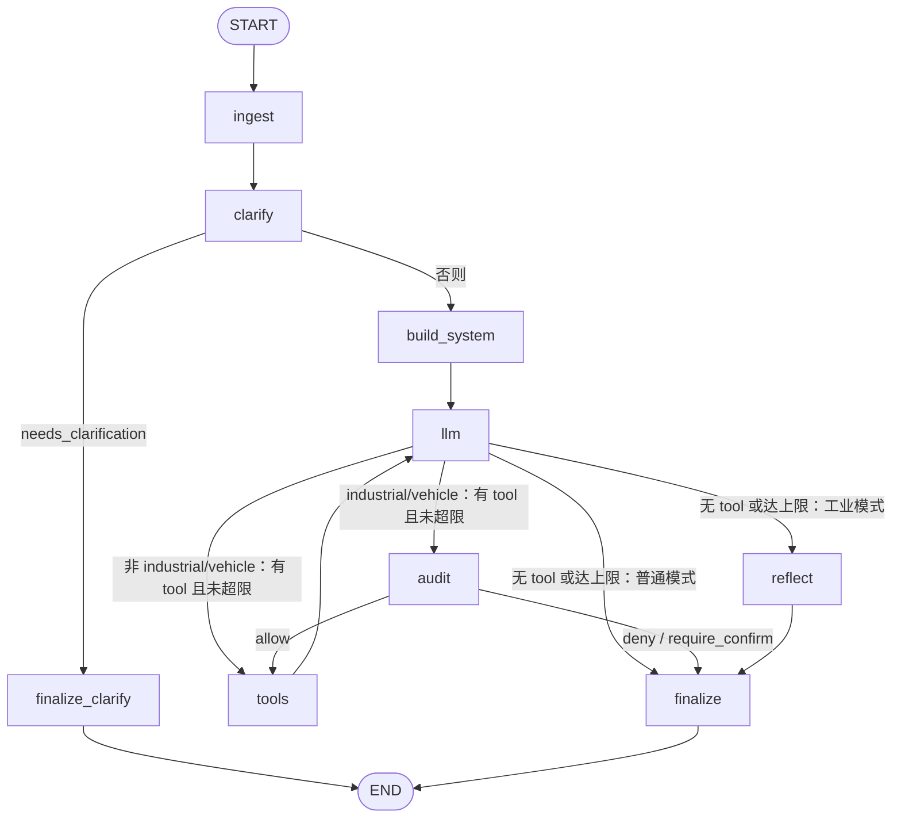

# 后端设计 · Agent LangGraph 编排架构

本文描述 `app/services/agent` 中 **智能助手** 的控制流实现方式：单一 **LangGraph** 状态图同时支撑 **JSON 非流式**（`POST /api/agent/chat`）与 **SSE 流式**（`POST /api/agent/chat/stream`）。产品需求仍以 [PRD · 智能 Agent](../../prd/backend/09-智能Agent.md) 为准。

## 1. 设计目标

| 目标 | 说明 |
|------|------|
| 单图单真相 | 澄清、RAG 注入、多轮 tool_calls 与收尾在同一张编译图中完成，避免「流式一套、非流式一套」分叉逻辑 |
| 行为对齐 | SSE 事件类型与字段保持与原实现一致：`delta` / `clarification` / `export_ready` / `done` |
| 可扩展 | 新增节点或改路由时只改 `graph/` 与 `build.py`，API 层薄封装 |

## 2. 目录与职责

```
app/services/agent/
├── service.py              # AgentService：ainvoke / astream、会话与标题等横切逻辑
├── graph/
│   ├── build.py            # StateGraph 编译：边与条件路由
│   ├── state.py            # AgentGraphState（TypedDict）
│   ├── nodes.py            # 各节点：ingest / clarify / build_system / llm / tools / audit / reflect / finalize*
│   ├── deps.py             # AgentGraphDeps（注入 AgentService）
│   ├── safety.py           # 工业审计 / 反思：提示词与结果规范化
│   ├── tool_tier.py        # 工具分级（只读跳过审计等）
│   ├── streamutil.py       # configurable.sse_stream 判断
│   └── tool_export.py      # 导出类工具的下载链接解析
├── llm/                    # LLMClient（OpenAI 兼容 HTTP）
├── tools/                  # ToolRegistry 与各工具实现
├── clarifier.py
├── context/session.py
└── skills/                 # 预留技能层（主对话链以 Tool 为主）
```

## 3. 状态图（节点与边）



- **ingest**：用请求体覆盖会话消息、计算 `last_user`、重置与澄清相关的状态字段。  
- **clarify**：调用 `Clarifier`；若需追问则 `needs_clarification=True`。  
- **finalize_clarify**：写入 assistant 澄清句、落库标题、填充 `ClarificationPayload`。  
- **build_system**：`get_system_prompt` + RAG（`mode=rag` 时 `_append_rag_retrieval`）+ **多层记忆**（`_append_memory_context`：工作/情景/语义/感知），组装 `llm_messages` 与 tool 声明。详见 [10-Agent多层记忆架构.md](./10-Agent多层记忆架构.md)。  
- **llm**：调用模型一轮；根据 `configurable.sse_stream` 与 `AGENT_STREAM_ENABLED` 选择流式或非流式。  
- **tools**：执行 `tool_calls`，追加 `tool` role 消息，收集 CSV 导出链接。  
- **audit**（`mode` 为 `industrial` 或 `vehicle` 且本轮拟执行工具）：独立安全审计 LLM，写入 `audit_result`；`deny` / `require_human_confirm` 直接收尾。  
- **reflect**（同上模式、进入收尾前）：质量反思 LLM，写入 `reflection_result`；`finalize` 据此可追加「需人工复核」或修订说明。  
- **finalize**：写入最终 assistant、标题与用量；处理审计拦截、待确认、反思叠加与「达轮次上限」等文案。

**轮次上限**：`llm_turn` 每进入一次 `llm` 自增；若本轮仍有 `tool_calls` 且 `llm_turn >= max_tool_rounds`，路由到 `finalize` 并给出超限提示（不再进入 `tools`）。

## 4. 非流式与流式如何共用一图

### 4.1 JSON：`chat()`

- 调用 `compiled_graph.ainvoke(initial_state)`。  
- **不**设置 `configurable.sse_stream`（默认为假）。  
- 节点内 **不**调用 `get_stream_writer()`，仅更新 `AgentGraphState`。  
- `AgentService` 将最终 state 映射为 `ChatResponse`。

### 4.2 SSE：`chat_sse_events()`

- 调用 `compiled_graph.astream(initial_state, config={"configurable": {"sse_stream": True}}, stream_mode=["custom", "values"])`。  
- 仅消费 `stream_mode == "custom"` 的块；`values` 可用于后续扩展调试。  
- 当 `sse_stream` 为真时：  
  - **node_llm**（且 `AGENT_STREAM_ENABLED`）：对流式 completion 的片段调用 `get_stream_writer()`，推送 `{"type":"delta","field":"reasoning|content","text":...}`。  
  - **node_tools**：每个导出成功推送 `export_ready`。  
  - **node_finalize_clarify**：推送 `clarification` 与 `done`。  
  - **node_finalize**：推送 `done`。  
- `AgentService` 对 `delta` 再套用 `_emit_sse_text_fragments`（与原先 UI 分片配置一致），其余类型原样 `yield`。

关闭流式模型开关时（`AGENT_STREAM_ENABLED=false`）：图中仍走同一节点，但 `llm` 为非流式调用，仅最终 `done` 携带全文，行为与旧版一致。

## 5. 依赖与配置

- **Python 包**：`langgraph`、`langchain-core`（见 `backend/requirements.txt`）。  
- **运行配置**：`AGENT_STREAM_ENABLED`、`AGENT_STREAM_UI_CHUNK_SIZE`、`AGENT_STREAM_YIELD_TO_LOOP` 等仍作用于 SSE 表现。  
- **Checkpoint**：当前 **未** 启用 LangGraph checkpointer；会话仍以内存 `SessionManager` + 可选 SQLite 仓库为准。

## 6. 与《07-Agent模块》的关系

- [07-Agent模块.md](./07-Agent模块.md) 保留 **路由、数据模型、工具列表、安全** 等总览。  
- **控制流与目录结构** 以本文为准；若两处冲突，以仓库代码与本文同步更新为准。

## 7. 后续可演进方向

- 为图接入 **checkpointer**，支持跨请求恢复与可观测 trace。  
- 将 **Skill** 拆为子图节点，与 Tool 层并列。  
- 使用 `astream_events` 统一产出面向可观测平台的 span（需评估与自定义 `delta` 的映射成本）。  
- **工业场景（已实现）**：`ChatRequest.mode` 为 **`industrial` 或 `vehicle`** 时，在 `llm` 与 `tools` 之间插入 **`audit`**，在收尾前插入 **`reflect`**（详见 [09-工业Agent-安全审计与反思.md](./09-工业Agent-安全审计与反思.md) §8）；本节 §3 状态图已反映该路由。

---

**修订**：2026-05-07 目录补充 `safety.py`、`tool_tier.py`；§7 标明工业节点已落地。
