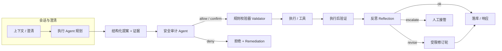

# 后端设计 · 工业 Agent：安全审计 Agent 与反思（Reflection）

本文与产品侧 [PRD · 工业巡检与遥控 Agent](../../prd/frontend/11-工业巡检与遥控Agent.md) 对齐，描述**业务与技术设计**：在工业执行链路中引入**独立安全审计 Agent**，以及**反思机制**用于评估本轮推理与（拟）执行是否合理。  
通用对话 Agent 的单图编排仍以 [08-Agent-LangGraph编排架构.md](./08-Agent-LangGraph编排架构.md) 为准；工业场景可在**同一套编排框架**上增加节点/子图或并行服务，下文给出推荐形态。

## 1. 设计目标

| 目标 | 说明 |
|------|------|
| **职责分离** | 「出主意 / 调工具」的执行面与「对照策略做合规与风险判断」的审计面分离，避免单模型既当运动员又当裁判员 |
| **默认拦截** | 审计不通过时，**不得**进入真实设备执行；只能返回结构化原因、整改建议或人工确认工单 |
| **可复盘** | 审计输入输出、反思结论与最终动作一并写入审计日志（与 PRD 5.1.5 一致），支持按会话/设备检索 |
| **时延可控** | 审计与反思可配置「快速规则 + 轻量模型」与「深度模型」两档，满足 P95 预算（见工业 PRD §7） |

## 2. 角色定义

### 2.1 工业执行 Agent（Executor）

- 职责：感知融合、任务分解、生成**结构化**动作提案（意图、动作、参数、证据、置信度）；在通过审计后触发工具/遥控 API。
- 约束：仍遵守「仅结构化输出触发控制」（PRD 5.1.2）、执行前规则校验器（5.1.3）。

### 2.2 安全审计 Agent（Safety Audit Agent）

- **独立上下文**：使用**单独 system prompt** 与（可选）**单独模型配置**，输入为「执行 Agent 的提案 + 证据摘要 + 当前策略版本 + 操作者角色」，**不**携带执行 Agent 的完整思维链（可只给脱敏后的推理摘要），降低被同源幻觉带偏的风险。
- **输出**（建议固定 JSON Schema，与前端控制台契约一致）：
  - `decision`: `allow` | `deny` | `require_human_confirm`
  - `risk_tier`: 与 PRD 风险级别对齐
  - `policy_hits`: 命中的规则 ID / 条款说明
  - `rationale`: 简短可展示理由（给人看）
  - `remediation`: `deny` 时的可执行建议（如缩小参数范围、补证据）
- **能力边界**：审计 Agent **不直接调设备**；仅读写策略库与审计日志；必要时只读拉取传感器/告警**快照 ID** 供复核，避免在审计阶段扩大工具面。

### 2.3 反思（Reflection）模块

- **目的**：在执行 Agent 完成一轮「推理 +（可选）工具结果」之后，用**二次推理**判断本轮行为是否合理：**是否答非所问、是否证据不足却断言、是否工具选择与用户意图不匹配、是否违反安全策略（与审计结论交叉验证）**。
- **与审计的关系**：
  - **审计**偏**合规与风险闸门**（能不能做）。
  - **反思**偏**质量与一致性**（做得对不对、说法是否站得住）；可触发「自我修订」：追加一轮 LLM 修正最终答复，或标记 `needs_human_review`。
- **输出**（建议结构化）：
  - `verdict`: `ok` | `revise` | `escalate`
  - `issues`: 条目列表（类型、说明、严重度）
  - `revised_summary`: 若 `revise`，给执行 Agent 或 finalize 节点的修订要点（非自由执行指令）。

## 3. 推荐链路（工业闭环）

- **审计**位于 **Validator 之前**：先过模型侧风险与策略解释，再过确定性规则（速度/角度/权限等）。  
- **反思**位于 **执行后验证之后**、最终响应之前：带「实际 telemetry 与预期」对比时反思质量更高。

## 4. 与 LangGraph 的衔接方式（实现导向）

| 方案 | 做法 | 适用 |
|------|------|------|
| **A. 单图增节点** | 在 `industrial` 模式下，`build_system → llm` 之间或 `llm` 与 `tools` 之间插入 `audit` 节点；`finalize` 前插入 `reflect` | 希望与现有 SSE/单图策略一致、观测简单 |
| **B. 审计子图** | `audit` 为 `StateGraph` 子图（内含策略检索 + 审计 LLM） | 审计逻辑复杂、需多步 |
| **C. 并行服务** | 执行图产出 `proposal_id`，HTTP 调用独立 `AuditService`，结果写回 state 再继续 | 团队边界清晰、独立扩缩容 |

**状态字段（概念）**：在 `AgentGraphState` 或工业专用 state 中增加 `audit_result`、`reflection_result`、`execution_trace_id`；SSE 可扩展事件类型 `audit`、`reflection`（需前端 PRD 同步）。

## 5. 策略库与日志

- **策略库**：版本化（`policy_version`）；审计 Agent 输出必须记录引用规则版本，便于回放。  
- **日志**：同一 `trace_id` 串联 执行提案、审计、校验器结果、执行回执、验证结果、反思结论；禁止覆盖，仅追加。

## 6. 验收要点（设计层）

- 高风险动作：审计结论为 `require_human_confirm` 时，无人工令牌不得执行。  
- `deny` 路径下，执行 Agent 不得绕过审计直接调遥控 API（后端 API 层二次校验 `audit_decision`）。  
- 反思为 `escalate` 时，默认不输出「已执行成功」类表述，仅输出接管指引。

## 7. 与现有智能助手 Agent 的边界

- **通用 `mode=general` / 知识问答 `mode=rag`**：走标准 `llm ⟷ tools` 路由，**不经过** `audit` / `reflect` 节点（工业专用提示与节流逻辑不启用）。  
- **`mode=industrial` 与 `mode=vehicle`**（与前端「工业巡检」及具身车控对话对齐）：在拟执行工具前走 **`audit`**，在收尾前按配置走 **`reflect`**（见 §8 实现状态与 `AGENT_INDUSTRIAL_*` 配置）。

---

**关联文档**：[07-Agent模块.md](./07-Agent模块.md)、[08-Agent-LangGraph编排架构.md](./08-Agent-LangGraph编排架构.md)、[PRD · 工业巡检与遥控 Agent](../../prd/frontend/11-工业巡检与遥控Agent.md)。

## 8. 实现状态（仓库）

- **触发条件**：`ChatRequest.mode` 为 `industrial` 或 `vehicle` 时，在拟执行工具前走 `audit` 节点，收尾前走 `reflect` 节点（图见 `graph/build.py`）。  
- **代码**：`graph/safety.py`（提示与规范化）、`graph/nodes.py`（`node_audit` / `node_reflect` / 路由）、`llm/client.py`（`chat_completion_json`）、`llm/prompts.py`（`industrial` 模式文案）。  
- **API**：`ChatResponse.industrial_audit` / `industrial_reflection`；SSE 事件类型 `audit`、`reflection`（摘要亦写入 `done.reasoning` 尾部便于前端合并）。

### 8.1 加速策略（默认开启）

- **分级审计**（`AGENT_INDUSTRIAL_AUDIT_TIERED`）：仅当本轮 `tool_calls` 含 **控制/导出**（如 `control_vehicle`、`control_arm_joints`、各类 `export_*`）或 **未登记工具名** 时走审计 LLM；纯只读工具（`get_*`、`get_vehicle_status`、`search_knowledge_base`、`get_current_time` 等）**跳过审计**，直接进入 `tools`。分类见 `graph/tool_tier.py`。  
- **条件反思**（`AGENT_INDUSTRIAL_REFLECTION_MODE=conditional`）：仅在 **无模型响应**、**达工具轮次上限**、或 **本 user 轮内 messages 已含 tool 结果** 时调用反思 LLM；纯文本直接答复默认不反思（可用 `AGENT_INDUSTRIAL_REFLECTION_ON_TEXT_ONLY=true` 强制也反思）。`off` / `always` 可关或全量反思。  
- **工具并行**（`AGENT_TOOLS_PARALLEL`）：同一轮多个 `tool_call` 并行 `execute`，写回 messages 仍按原顺序。  

`/api/agent/health` 返回 `industrial_audit_tiered`、`tools_parallel`、`industrial_reflection_mode` 便于前端展示。

---

**修订**：2026-05-07 §7 与当前 `general`/`rag` 不经审计、`industrial`/`vehicle` 经 audit/reflect 的实现一致。
