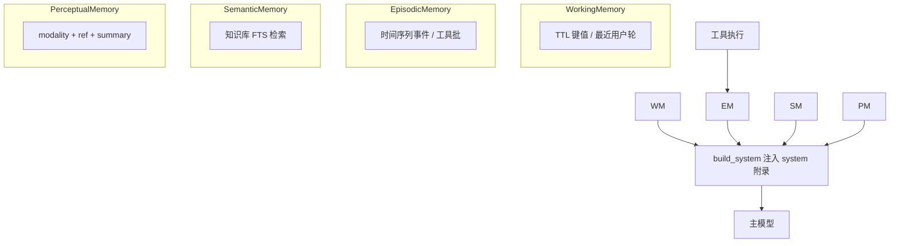

# 后端设计 · Agent 多层记忆架构

本文定义智能 Agent 的 **四层记忆** 职责边界、与现有模块的映射及实现落点。实现代码见 `app/services/agent/memory/`、`app/models/agent_memory_layers.py`、`app/repositories/agent_memory_repo.py`。

## 1. 四层模型

| 层级 | 英文 | 职责 | 数据形态与生命周期 |
|------|------|------|-------------------|
| **工作记忆** | WorkingMemory | 当前会话的**临时**槽位（最近意图锚点、短 TTL 键值） | 进程内 dict + TTL；重启清空 |
| **情景记忆** | EpisodicMemory | **带时间轴的事件**（如每轮工具批摘要） | SQLite `agent_episodic_memory` |
| **语义记忆** | SemanticMemory | **抽象知识**检索（与知识库/手册一致） | 复用 `KnowledgeService`（FTS）；`rag` 模式仍以原有全量 RAG 注入为主，通用模式可**轻量 top_k** 摘要注入 |
| **感知记忆** | PerceptualMemory | **多模态引用**（图像/视频帧/遥测快照等）的摘要与 ref | SQLite `agent_perceptual_memory`；可由业务侧 API 写入 |

## 2. 与 LangGraph 的衔接

- **ingest**：刷新工作记忆 `last_user_turn`（锚定当前用户话）。  
- **build_system**：在 `_append_rag_retrieval` **之后** 调用 `_append_memory_context`，将四层附录拼入 **system**（受 `AGENT_MEMORY_INJECT_MAX_CHARS` 预算限制）。  
- **tools**：每批工具执行结束后写入一条 **情景记忆**（`tool_batch`）。  
- **delete_session**：同时清理工作记忆槽位 + 情景/感知表中该 `session_id` 记录。

## 3. 配置项（`app/core/config.py`）

| 变量 | 说明 |
|------|------|
| `AGENT_MEMORY_LAYERS_ENABLED` | 总开关 |
| `AGENT_MEMORY_WORKING_TTL_SEC` | 工作记忆默认 TTL（秒） |
| `AGENT_MEMORY_SEMANTIC_IN_GENERAL` | 非 `rag` 模式是否注入轻量语义命中 |
| `AGENT_MEMORY_SEMANTIC_TOP_K` | 轻量语义条数 |
| `AGENT_MEMORY_INJECT_MAX_CHARS` | 注入 system 的总字符上限 |

## 4. 演进方向

- **图谱关系**：语义层可对接独立知识图谱服务，当前仍以 FTS 片段为主。  
- **感知写入**：已实现 `POST /api/agent/memory/perceptual`（需登录 Bearer；body 含 `session_id`、`modality`、`ref`、`summary`），供巡检/视频服务推送帧引用。  
- **跨会话情景**：可按 `user_id` 聚合长期情景（当前仅 `conversation_id` 维度）。

---

**关联**：[08-Agent-LangGraph编排架构.md](./08-Agent-LangGraph编排架构.md)、[07-Agent模块.md](./07-Agent模块.md)。

**修订**：2026-05-07 与当前 FTS 知识库表述一致（语义层与 `KnowledgeService` 同源）；注入顺序仍为 RAG 全量片段（`rag` 模式）之后拼接多层记忆附录。
